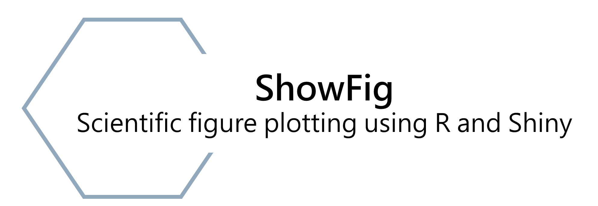

<!--
**Tiffany9583/Tiffany9583** is a ✨ _special_ ✨ repository because its `README.md` (this file) appears on your GitHub profile.

Here are some ideas to get you started:

- 🔭 I’m currently working on ...
- 🌱 I’m currently learning ...
- 👯 I’m looking to collaborate on ...
- 🤔 I’m looking for help with ...
- 💬 Ask me about ...
- 📫 How to reach me: ...
- 😄 Pronouns: ...
- ⚡ Fun fact: ...
-->

<h1 align = "center"> 💫 Hi there, I am Yi-Ting Hung 👋</h1>

I am a Ph.D. student who is excited about the huge potential of artificial intelligence in entomology. My passions are **Insect behavior** and **Machine Learning**. My previous work includes research & development in **Metagenomics** , **R data Visualization** and **Automatic insect tracking**.

<h2> Current and previous projects: </h2>
<h3> :muscle: Automatic fruit fly tracking </h3>
This is the project that I am working on. The goal of the project is to track flies and analysis their social activity.
<table>
  <tr>
    <td>
      
    </td>
    <td>
      
    </td>
  </tr>
</table>

<h3> :beetle: Know more pest website development  </h3>
I also work on website development. In the previous hackathon competition, we developed a website to introduce common indoor pests in a close and cute way.

Quick Overview of the project

<h3> :bar_chart: ShowFig website development </h3>
Data visualization always a big challenge for scientists. In this project, I created a program for my partner laboratory that utilizes customized R code to generate accurate and efficient visual representations. 
ShowFig is a scientific figure plotting website built with R and Shiny.

<table>
  <tr>
    <td>
      
    </td>
    <td>
      
    </td>
  </tr>
</table>

You can find the code on
[**ShowFig**](https://github.com/Tiffany9583/ShowFig).

<h2>:punch: My Skills:</h2>

With an entomology major and computer science background, I excel at molecular bench work, statistics, and programming, which distinguish me with great ability to perform interdisciplinary machine learning applications on entomology or bioinformatics data scientists takes.

<h3> Programming Languages </h3>

      

<h2>:email: Connect with me:</h2>

